# School_District_Analysis

## Overview of the school district analysis: Explain the purpose of this analysis.

The school board has notified Maria and her supervisor that the students_complete.csv file shows evidence of academic dishonesty; specifically, reading and math grades for Thomas High School ninth graders appear to have been altered. Although the school board does not know the full extent of the academic dishonesty, they want to uphold state-testing standards and have turned to Maria for help. She has asked you to replace the math and reading scores for Thomas High School with NaNs while keeping the rest of the data intact. Once you’ve replaced the math and reading scores, Maria would like you to repeat the school district analysis that you did in this module and write up a report to describe how these changes affected the overall analysis.

## Results

### How is the district summary affected?

District  Summary is not significantly affected by removing the 9th graders results.By removing the 467 students on 9th grade , the effect is a very slight reduction on scores, that can only be seen with 1 or more  significant digits, affecting the overall passing % from 65.2% to 64.9%. 

* Initial Analysis

* Updated Analysis 

### How is the school summary affected?

THS scores are slightly different, average reading score is slightly higher on updated Analysis and all other metrics are about 0.015-0.03 lower than original. 

* Initial Analysis

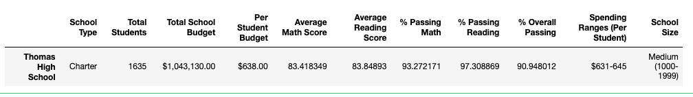

* Updated Analysis

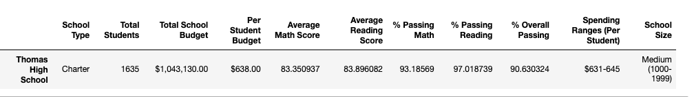

### How does replacing the ninth graders’ math and reading scores affect Thomas High School’s performance relative to the other schools?

Thomas High School is still  on same rank based on overall passing %, even though there is a slight  decrease from 90.94% to 90.63%. 

* Initial Analysis

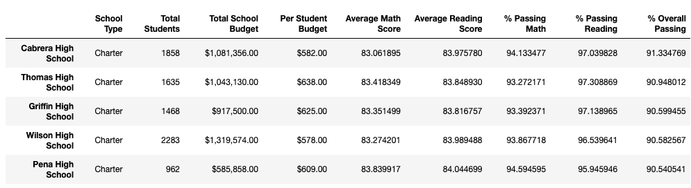

* Updated Analysis

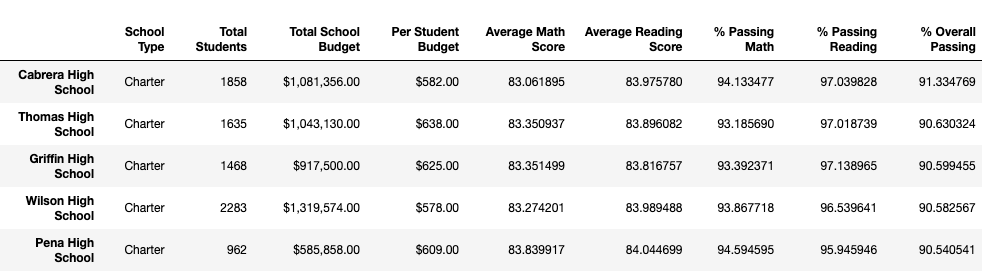

### Math and reading scores by grade:

There is no effect to scores on other grades and high schools, only difference is now 9th grade for THS is blank. 

#### Math Scores 

* Initial Analysis

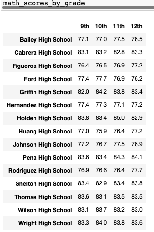

* Updated Analysis

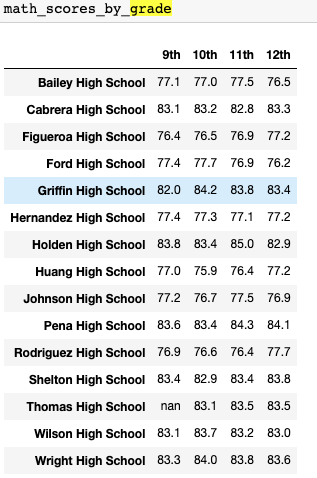

#### Reading Scores

* Initial Analysis

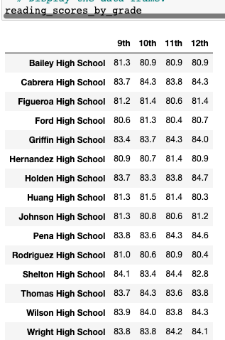

* Updated Analysis

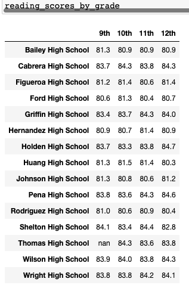

### Scores by school spending:

There is virtually no change on the results grouped by spending. Slight reduction of  ~0.01 on % overall passing and % reading, on 631-645 Spending Range 

* Initial Analysis 

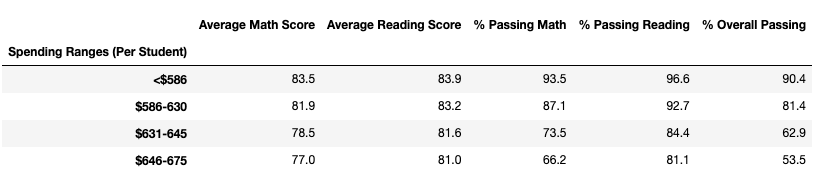

* Updated Analysis

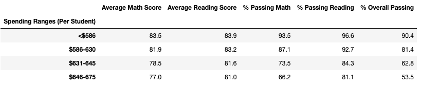

### Scores by school size

There is virtually no change on the results grouped by size. 

* Initial Analysis

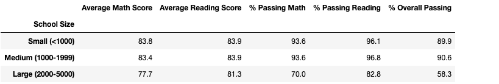

* Updated Analysis

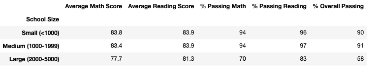

### Scores by school type

There is virtually no change on the results grouped by Type. 

* Initial Analysis

* Updated Analysis

## Summary:

After reading and math scores for the ninth grade at Thomas High School have been replaced with NaNs,  here are some of the slight changes:

* District % Overall Passing Result is 64.9% compared to 65.2%. 
* THS % Overall Passing is ~0.03% lower than initial result, but still leaves them in same rank, being number  2 in the district. 
* THS Scores are affected.  Avg Reading Score is slightly higher, from 83.85% to 83.90% and the rest of metrics decreased about 0.015 to 0.03 compared to original result. 
* Slight reduction ~0.01 on % overall passing and % reading on spending range per student  of 631-645

