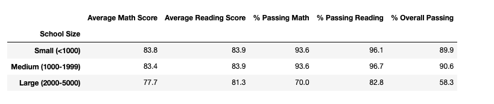

# School_District_Analysis

## Overview of the school district analysis: Explain the purpose of this analysis.

The school board has notified Maria and her supervisor that the students_complete.csv file shows evidence of academic dishonesty; specifically, reading and math grades for Thomas High School ninth graders appear to have been altered. Although the school board does not know the full extent of the academic dishonesty, they want to uphold state-testing standards and have turned to Maria for help. She has asked you to replace the math and reading scores for Thomas High School with NaNs while keeping the rest of the data intact. Once you’ve replaced the math and reading scores, Maria would like you to repeat the school district analysis that you did in this module and write up a report to describe how these changes affected the overall analysis.

## Results

### How is the district summary affected?

District  Summary is not significantly affected by removing the 9th graders results.By removing the 467 students on 9th grade , the effect is a very slight reduction on scores, barely affecting the overall passing from 65% to 64.9%

* Initial Analysis

* Updated Analysis 

### How is the school summary affected?

THS scores are slightly different, lower compared to the initial analysis. 

* Initial Analysis

* Updated Analysis

### How does replacing the ninth graders’ math and reading scores affect Thomas High School’s performance relative to the other schools?

Thomas High School is still  on same rank based on overall passing %, even though there is a slight  decrease from 90.94% to 90.63%. 

* Initial Analysis

* Updated Analysis

### Math and reading scores by grade:

There is no effect to scores on other grades and high schools, only difference is now 9th grade for THS is blank. 

#### Math Scores 
* Initial Analysis

* Updated Analysis

#### Reading Scores

* Initial Analysis

* Updated Analysis

### Scores by school spending:

* Initial Analysis 

* Updated Analysis

### Scores by school size

* Initial Analysis

* Updated Analysis

### Scores by school type

* Initial Analysis

* Updated Analysis

## Summary:

Summarize four changes in the updated school district analysis after reading and math scores for the ninth grade at Thomas High School have been replaced with NaNs.

* % Overall Passing Students at THS is 0.03% lower than initial analysis
*  

A high-level snapshot of the district's key metrics, presented in a table format
An overview of the key metrics for each school, presented in a table format
Tables presenting each of the following metrics:
Top 5 and bottom 5 performing schools, based on the overall passing rate
The average math score received by students in each grade level at each school
The average reading score received by students in each grade level at each school
School performance based on the budget per student
School performance based on the school size 
School performance based on the type of school
